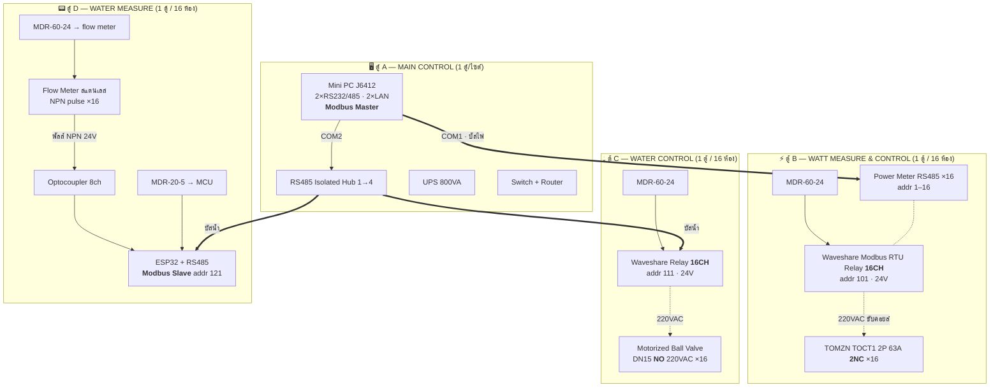

# ⚡💧 ระบบวัด/ตัด น้ำ-ไฟ รายห้อง — การต่อระบบทั้งหมด (Modbus RTU บน RS485)

> เอกสารออกแบบระดับติดตั้งจริง · อ้างอิงอุปกรณ์ใน [ref_hardware.md](ref_hardware.md)
> อัปเดต 2026-08-02 · ใช้ **Waveshare Modbus RTU Relay 16CH** (1 บอร์ด = 16 ห้อง)
>
> 📐 **ไดอะแกรม:** [ผังระบบรวม](diagrams/01-ผังระบบรวม-RS485.svg) · [schematic ตู้ B ระดับขั้วต่อ](diagrams/02-schematic-ตู้B-วัดและตัดไฟ.svg) — [วิธีอ่าน](diagrams/README.md)
> 💰 **ราคา:** [BOM .xlsx](BOM_ระบบวัดตัดน้ำไฟ_4-8-16-24ห้อง.xlsx) · [สรุปราคา .pdf](สรุปราคา_ระบบวัดตัดน้ำไฟ_4-8-16-24ห้อง.pdf)

---

## 1. ภาพรวมสถาปัตยกรรม

**หลักการ:** ทุกตู้แยกกันทางกายภาพ เชื่อมกันด้วย **RS485 3 เส้น (A / B / GND)** เท่านั้น
Mini PC 1 เครื่อง = Modbus **Master** ตัวเดียวของทั้งระบบ (ไม่มี MCU กลาง ไม่มีเซิร์ฟเวอร์เพิ่ม)

> ✅ **สรุปการตัดสินใจ:** ใช้ **RS485 ทั้งระบบ** — มิเตอร์ไฟและมิเตอร์น้ำเป็น Modbus RS485 ทั้งคู่
> ไม่มีตู้ D (นับพัลส์) ไม่มีเฟิร์มแวร์ที่ต้องดูแลเอง → **1 ชุด = 2 ตู้ (B + C) ต่อ 16 ห้อง**



### แบ่งบัส RS485

| บัส | พอร์ต | อุปกรณ์บนบัส | จำนวน node ที่ 24 ห้อง |
|-----|-------|--------------|----------------------|
| **บัส 1 — ELECTRIC** | USB→RS485 isolated #1 | Power meter addr 1–24 + Relay board addr 101–102 | 26 |
| **บัส 2 — WATER** | USB→RS485 isolated #2 | Valve relay addr 111–112 + **มิเตอร์น้ำ addr 31–54** | 26 |

> **ทำไมต้องแยก 2 บัส:** RS485 เป็น half-duplex master เดียว — ทุก node ต่อคิวกัน
> บัสไฟมี node เยอะ (มิเตอร์ 24 ตัว) ถ้าเอาน้ำมารวมด้วย รอบ poll จะช้า และถ้าบัสไฟล่ม น้ำจะล่มตาม
> **ที่ 24 ห้องยังไม่ชนเพดาน** (มาตรฐาน 32 unit loads/segment) แต่ถ้าเกิน 24 ห้องให้เพิ่ม USB-RS485 isolated adapter เป็นบัสที่ 3

---

## 2. ⭐ RS485 ในระบบนี้ "กี่โวลต์" — ตอบให้ครบ

คำถามนี้มี 2 ชั้น ต้องแยกให้ชัด เพราะเป็นคนละเรื่องกัน

### 2.1 แรงดันบน "สายสัญญาณ" RS485 → **เท่ากันหมดทั้งระบบ**

RS485 เป็น **differential** — ค่าที่มีความหมายคือผลต่าง A−B ไม่ใช่แรงดันเทียบกราวด์
ตามมาตรฐาน **TIA/EIA-485-A** ทุกอุปกรณ์ต้องอยู่ในกรอบนี้ ไม่ว่าไฟเลี้ยงบอร์ดจะกี่โวลต์:

| พารามิเตอร์ | ค่าตามมาตรฐาน | ค่าที่วัดได้จริงในระบบนี้ |
|-------------|---------------|--------------------------|
| Driver output differential \|V<sub>OD</sub>\| | ≥ 1.5 V (โหลด 54Ω) · ≤ 5 V (ไม่มีโหลด) | **2.0 – 3.5 V** |
| Logic 1 (mark / idle) | A − B = **บวก** | +2 ถึง +5 V |
| Logic 0 (space) | A − B = **ลบ** | −2 ถึง −5 V |
| Idle bias (ไม่มีใครส่ง) | ≥ +200 mV | +0.2 ถึง +1.0 V |
| Receiver sensitivity | ±200 mV | — |
| **Common-mode range (V<sub>CM</sub>)** | **−7 V ถึง +12 V** | ← **ตัวชี้เป็นชี้ตายของระบบหลายตู้** |
| Absolute max ที่ขา A/B (MAX485 ทั่วไป) | −8 V ถึง +12.5 V | บอร์ด Waveshare มี TVS กันเพิ่ม |

> ✅ **สรุปข้อนี้:** สาย RS485 ทุกเส้นในระบบนี้เป็น **สัญญาณ differential ±2–5 V เท่ากันหมด**
> ไม่มี "RS485 5V" กับ "RS485 24V" — ต่อข้ามยี่ห้อ ข้ามแรงดันไฟเลี้ยงได้เลย

### 2.2 แรงดัน "ไฟเลี้ยง" ของแต่ละอุปกรณ์ → **ต่างกัน** (นี่คือสิ่งที่ต้องออกแบบ)

| # | อุปกรณ์ | ไฟเลี้ยงบอร์ด | ไฟเลี้ยงภาค RS485 | Isolation | มาจาก |
|---|---------|--------------|-------------------|-----------|-------|
| 1 | **Mini PC** COM1/COM2 (DB9) — *ใช้เป็นตัวสำรอง* | 12 V DC (adapter) | 3.3/5 V ภายใน | ❌ **ปกติไม่มี → จึงใช้ USB adapter แทน** | อะแดปเตอร์ + UPS |
| 2 | **Waveshare Modbus RTU Relay 16CH** | **7 – 36 V DC** → ใช้ **24 V** | 3.3 V (มี DC-DC + magnetic isolation) | ✅ มี | MDR-60-24 |
| 3 | **Power Meter DIN RS485** | **220 VAC** (self-powered จากไฟที่วัด) | ภายใน isolated | ✅ มี | เมนไฟ |
| 4 | **ESP32 นับพัลส์ (DIY)** | 5 V (VIN) → 3.3 V logic | 3.3 V (ADM2483) หรือ 5 V (MAX485) | ⚠️ ต้องเลือกรุ่น isolated | MDR-20-5 |
| 5 | **USB → RS485 isolated ×2** | จ่ายไฟจากพอร์ต USB | isolated ทั้ง 2 บัส | ✅ **มี — กัน surge เข้าเมนบอร์ด** | Mini PC |
| 6 | Flow Meter สแตนเลส | **5 – 24 V DC** → ใช้ **24 V** | ❌ **ไม่ใช่ RS485** — เป็น NPN open-collector pulse | ผ่าน optocoupler | MDR-60-24 |
| 7 | Optocoupler 8ch | ฝั่ง input 24 V / ฝั่ง output **3.3 V** | ❌ ไม่ใช่ RS485 | ✅ แยกกราวด์ | MDR-60-24 / ESP32 3V3 |
| 8 | TOCT1 คอยล์คอนแทกเตอร์ | **220 VAC** ~6 VA | ❌ ไม่ใช่ RS485 | — | เมนไฟผ่าน MCB 6A |
| 9 | Motorized Ball Valve DN15 NO | **220 VAC** ~5 W | ❌ ไม่ใช่ RS485 | — | เมนไฟผ่าน MCB 6A |

### 2.3 ⚠️ ผลที่ตามมา (ข้อนี้สำคัญที่สุดของทั้งเอกสาร)

เพราะแต่ละตู้ **มี power supply ของตัวเอง** และกราวด์แต่ละตู้อาจต่างกันหลายโวลต์:

1. **ต้องเดินสาย GND (common) ระหว่างตู้ด้วยเสมอ — RS485 คือ 3 เส้น ไม่ใช่ 2**
   ถ้าเดินแค่ A กับ B แล้วกราวด์ต่างตู้ต่างกันเกิน ±7 V → **เกิน common-mode range → transceiver พังถาวร**
   นี่คือสาเหตุอันดับ 1 ที่ระบบ RS485 หลายตู้พังในสัปดาห์แรก
2. **ต่อ GND ผ่านตัวต้านทาน 100 Ω 1/2W อนุกรม** ที่ปลายแต่ละอุปกรณ์ (ไม่ใช่ต่อตรง) — กันกระแส ground loop ไหลผ่านสายสัญญาณ
3. **shield ของสายต่อลงกราวด์ "ปลายเดียว" เท่านั้น** — ที่ตู้ Main Control ปลายอีกด้านปล่อยลอย + หุ้มฉนวน
4. เลือกบอร์ด RS485 ที่ **isolated** ให้ได้มากที่สุด (Waveshare (B) มีให้แล้ว, ฝั่ง DIY ควรใช้ ADM2483 แทน MAX485 เปล่า ๆ เพิ่มแค่ ~100฿ แต่กันพังทั้งบอร์ด)

---

## 3. การต่อระบบอย่างละเอียด (ทีละตู้)

### 3.1 ตู้ A — MAIN CONTROL

```
เมน 220VAC ──► MCB 1P 10A ──► UPS 800VA ──┬──► Mini PC (adapter 12V)
                                          ├──► Switch 5 port
                                          └──► (ไม่ต้องมี RS485 Hub — ดูเหตุผลข้อ 3.1.1)

Mini PC USB1 ──► USB-to-RS485 **isolated** #1 (A+/B−/GND) ──► บัส 1 (ELECTRIC) ──► ตู้ B
Mini PC USB2 ──► USB-to-RS485 **isolated** #2 (A+/B−/GND) ──► บัส 2 (WATER)    ──► ตู้ C

(พอร์ต COM1/COM2 บนเครื่องเก็บไว้เป็น "ตัวสำรอง" — ถ้า adapter เสียกลางดึก เสียบสายกลับเข้า COM ใช้ชั่วคราวได้
 โดยต้องมี DB9-to-Terminal breakout สำรองไว้ 1 ตัว)
Mini PC LAN1 ──► Switch ──► Router/Internet   (ส่งข้อมูลขึ้น VPS 147.50.254.104)
Mini PC LAN2 ──► สำรอง / กล้อง / เครื่องมือช่าง
```

**พินของพอร์ต DB9 บน Mini PC J6412** (สำคัญ — ต้องเช็ค):
โหมด RS485 ของ Mini PC อุตสาหกรรมกลุ่มนี้ **ไม่มีมาตรฐานเดียว** พบได้ 2 แบบ

| แบบ | Pin 1 | Pin 2 | Pin 5 | หมายเหตุ |
|-----|-------|-------|-------|----------|
| A (พบบ่อยสุด) | **D+ (A)** | **D− (B)** | GND | |
| B | — | — | GND | D+ = pin 3, D− = pin 4 |

> 🔧 **ก่อนต่อจริง:** ตั้งจัมเปอร์/BIOS ให้เป็นโหมด RS485 ก่อน แล้ววัดด้วยมัลติมิเตอร์
> ปล่อยบัสว่าง ๆ วัด pin ที่สงสัยเทียบ pin 5 → คู่ที่เป็น **+ประมาณ 2–3 V / +1 V แบบ idle bias** คือ A/B
> หรือใช้วิธีปลอดภัย: **ต่อสลับ A↔B ได้ ไม่พัง** ถ้าอ่านไม่ขึ้นให้สลับดู

---

### 3.2 ตู้ B — WATT MEASURE & CONTROL ⚡

#### ⚠️ จุดที่ผมขอแก้จากไดอะแกรมเดิม: **ลำดับ มิเตอร์ ↔ คอนแทกเตอร์**

ไดอะแกรมในภาพต่อ **คอนแทกเตอร์ → มิเตอร์ → โหลด**
ปัญหา: พอสั่งตัดไฟห้องนั้น **มิเตอร์ดับไปด้วย → หลุดจากบัส RS485** → ระบบแยกไม่ออกว่า "ตัดสำเร็จ" หรือ "มิเตอร์เสีย/สายหลุด" และอ่านค่าสะสมไม่ได้จนกว่าจะจ่ายไฟคืน

**แนะนำสลับเป็น มิเตอร์ → คอนแทกเตอร์ → โหลด:**

```
บัสบาร์ L ──► MCB 1P 32A (แผง n)
                 │
                 └──► [Power Meter] ขั้ว 1 = L IN
                              ขั้ว 2 = L OUT ──► [TOCT1] ขั้ว 1 (หน้าสัมผัส NC)
                              ขั้ว 3 = N IN  ◄── บาร์ N        │
                              ขั้ว 4 = N OUT ──────────┐       │
                                                       │       └──► ขั้ว 2 ──► L ไปแผง n
บาร์ PE ───────────────────────────────────────────────┴──────────► N + PE ไปแผง n
```

ได้ผลลัพธ์: มิเตอร์มีไฟเลี้ยงตลอดเวลา → **ตัดไฟแล้วยังอ่านค่าได้** (V มี, A = 0) = ยืนยันผลการตัดได้จริง ตรวจสอบย้อนหลังได้ (ตรงกับหลักการ auditable ของโปรเจกต์)

#### การขับคอยล์คอนแทกเตอร์ (220VAC)

```
MCB 1P 6A (วงจรควบคุม) ──► บาร์ L-control ──► Relay CH_n : COM
                                              Relay CH_n : NO ──► TOCT1 ขั้ว A1
บาร์ N ─────────────────────────────────────────────────────────► TOCT1 ขั้ว A2
```

**ตรรกะ (ใช้ TOCT1 แบบ 2NC + relay contact NO):**

| สถานะ Relay | คอยล์ | หน้าสัมผัส NC | แผงค้าได้ไฟ? |
|-------------|-------|---------------|-------------|
| OFF (ปกติ) | ไม่มีไฟ | **ปิด** | ✅ มีไฟ |
| ON (สั่งตัด) | 220VAC | **เปิด** | ❌ ไฟดับ |

> ✅ **Fail-safe ถูกทางแล้ว:** Mini PC ดับ / บอร์ดรีเลย์ดับ / สาย RS485 ขาด → รีเลย์ตกหมด → **ทุกแผงมีไฟ**
> ผู้เช่าไม่โดนตัดเพราะระบบเรามีปัญหา (ซึ่งเป็นเรื่องที่ต้องเลี่ยงที่สุดในเชิงกฎหมาย/สัญญาเช่า)
> ✅ **ประหยัดไฟ:** คอยล์กิน ~6 VA เฉพาะห้องที่โดนตัด ซึ่งเป็นส่วนน้อย

**สเปกที่ต้องตรงกัน (เช็คแล้ว):** หน้าสัมผัสรีเลย์ Waveshare = **10 A / 250 VAC** · คอยล์ TOCT1 กระชาก ~60 VA (0.27 A) ค้าง ~6 VA (0.027 A) → **เหลือ margin เยอะมาก ปลอดภัย**

**⚠️ สั่งของให้ถูกรุ่น:** TOCT1 2P 63A มีทั้ง **2NO / 2NC / 1NO+1NC** — ต้องระบุ **2NC** เท่านั้น ถ้าได้ 2NO มาตรรกะจะกลับด้าน และ fail-safe จะกลายเป็น "ไฟดับทุกแผงเมื่อระบบล่ม"

---

### 3.3 ตู้ C — WATER CONTROL 💧

```
MCB 1P 6A ──► บาร์ L-control ──► Relay CH_n : COM
                                 Relay CH_n : NO ──► วาล์วสาย L (น้ำตาล)
บาร์ N ──────────────────────────────────────────► วาล์วสาย N (ฟ้า)
                                                   วาล์วสาย PE (เขียว-เหลือง) ──► บาร์ PE
MDR-60-24 ──► Waveshare Relay board VCC(+24V) / GND
```

| สถานะ Relay | วาล์ว NO | น้ำ |
|-------------|----------|-----|
| OFF (ปกติ) | เปิดค้าง | ✅ ไหล |
| ON (สั่งตัด) | มอเตอร์หมุนปิด ~5–15 วิ แล้วลิมิตสวิตช์ตัดมอเตอร์เอง | ❌ ไม่ไหล |

> 💡 วาล์วชนิด motorized ball valve **ค้างตำแหน่งได้โดยไม่กินไฟต่อเนื่อง** (ต่างจาก solenoid ที่ต้องจ่ายไฟค้าง) — เลือกถูกแล้ว
> 💡 ในซอฟต์แวร์ต้อง **หน่วง 20 วินาที** ก่อนเช็คผล เพราะวาล์วหมุนช้ากว่ารีเลย์มาก
> 💡 ติด **วาล์วมือ (by-pass) + ยูเนี่ยน** คร่อมวาล์วไฟฟ้าทุกตัว เผื่อวาล์วเสียแล้วต้องเปิดน้ำฉุกเฉิน/ถอดซ่อม

---

### 3.4 ตู้ D — WATER MEASURE 📟 (ส่วน DIY)

```
                    ┌── MDR-60-24 (+24V) ──► Flow Meter สาย แดง (VCC)
                    │                        Flow Meter สาย ดำ  (GND) ──► 24V GND
                    │                        Flow Meter สาย เหลือง (NPN OC) ──┐
                    │                                                        │
  24V+ ─────────────┴──────────────────► Opto board : IN-COM (+)             │
                                          Opto board : IN_n  ◄───────────────┘
  ───────────────────── แยกกราวด์ทางแสง (galvanic isolation) ─────────────────
  ESP32 3V3 ──► Opto board : OUT-VCC        Opto OUT_n ──► ESP32 GPIO (pull-up ภายใน)
  ESP32 GND ──► Opto board : OUT-GND

  MDR-20-5 (+5V) ──► ESP32 VIN / 5V         ESP32 UART2 TX/RX ──► โมดูล RS485 isolated
                                                                  ├── A ──► บัสน้ำ A
                                                                  ├── B ──► บัสน้ำ B
                                                                  └── GND ─► บัสน้ำ GND (ผ่าน R 100Ω)
```

#### ⚠️ 4 จุดที่พลาดง่ายมากในส่วนนี้

**1) แรงดัน input ของบอร์ด optocoupler**
บอร์ด opto 8 ช่องราคาถูกใน Shopee ส่วนใหญ่ออกแบบมาสำหรับ input **3.3–5 V** (ตัวต้านทานอนุกรม ~1 kΩ)
ถ้าป้อน **24 V เข้าไปตรง ๆ → LED ใน optocoupler ไหม้ทันที**
→ **ต้องซื้อรุ่นที่ระบุ "input 3.3V–24V" ชัดเจน** หรือถ้าได้รุ่น 5 V มาแล้ว ให้ **ต่อ R 2.2 kΩ 1/4W อนุกรมเพิ่มทุกช่อง** (24V − 1.2V ≈ 7 mA ผ่าน LED กำลังดี)

**2) แรงดัน output ต้องเป็น 3.3 V ไม่ใช่ 5 V**
ฝั่งขาออกของ opto คือ collector ของโฟโต้ทรานซิสเตอร์ ต่อ pull-up ไป VCC
→ **ป้อน VCC ฝั่งขาออกจากพิน 3V3 ของ ESP32** (ไม่ใช่ 5 V) ไม่งั้น GPIO ของ ESP32 จะโดน 5 V เข้า → พัง
→ MDR-20-5 ใช้เลี้ยง **VIN ของ ESP32 เท่านั้น**

**3) ตัวนับพัลส์ต้องรอดจากการ reboot** ← เรื่องบิลผิดโดยตรง
ESP32 รีบูต/ไฟดับ → ค่านับหายหมด → บิลน้ำผิด
→ **เขียนค่าลง NVS flash ทุก 100 พัลส์ หรือทุก 60 วินาที** (อันไหนถึงก่อน)
→ ฝั่ง server ให้เก็บเป็น **cumulative totalizer** และมี logic ตรวจ "counter ถอยหลัง = อุปกรณ์รีเซ็ต" แล้วชดเชย ไม่ใช่คิดเป็นค่าติดลบ
→ debounce ในเฟิร์มแวร์ (ตัดพัลส์ที่ห่างกัน < 1 ms ทิ้ง) กันสัญญาณรบกวนจากสายยาว

**4) ความยาวสายพัลส์**
สัญญาณ NPN open-collector ไม่ทนสัญญาณรบกวนเท่า RS485
→ ใช้ **สาย shielded** และจำกัด **≤ 30 เมตร** ต่อ flow meter
→ ถ้าห้องอยู่ไกลกว่านั้น ให้ย้ายตู้ D ไปใกล้กลุ่มห้อง แล้วลาก RS485 (ที่ไปได้ 1,200 ม.) กลับมาแทน — **นี่คือข้อดีหลักของการแยกตู้**

#### 📌 ทางเลือกที่ควรพิจารณาจริงจัง: เลิก DIY ไปใช้มิเตอร์น้ำ RS485 ตรง ๆ

| แนวทาง | ราคา/ห้อง | ความแม่น | ความเสี่ยง |
|--------|-----------|----------|-----------|
| Flow meter พัลส์ + DIY counter (แผนปัจจุบัน) | ~350 ฿ + ตู้ D | ⚠️ **น้ำไหลช้า < 1–2 L/min จะนับไม่ได้** · ต้องคาลิเบรต K-factor (พัลส์/ลิตร) เอง | เฟิร์มแวร์เราเขียนเอง = เราซัพพอร์ตเอง |
| มิเตอร์น้ำ RS485 photoelectric (อ่านเลขหน้าปัดจริง) | ~1,000–2,500 ฿ | ✅ error = 0 ไม่มีตู้ D ไม่มีเฟิร์มแวร์ | ไม่มี |

> จาก [datasheets/README.md](../datasheets/README.md) โปรเจกต์นี้มี register map ของมิเตอร์น้ำ RS485 อยู่แล้ว
> **ที่ 24 ห้อง: DIY ประหยัดได้ ~15,000 ฿ แต่แลกมาด้วยความเสี่ยงเรื่องความแม่นยำในการเก็บเงิน**
> 🔴 **ข้อควรระวังทางกฎหมาย:** flow meter อุตสาหกรรมไม่ใช่ "มาตรวัดน้ำ" ที่ผ่านการรับรองจากสำนักงานกลางชั่งตวงวัด — ถ้าผู้เช่าโต้แย้งบิล เราไม่มีเอกสารรับรองยืนยัน ควรระบุในสัญญาเช่าให้ชัด หรือใช้มิเตอร์ที่ผ่านการรับรอง

---

## 4. 🔌 Connector / สาย / อุปกรณ์ประกอบ — ใช้อะไรบ้าง

### 4.1 สายสัญญาณ RS485 (สายเส้นเลือดใหญ่ของระบบ)

| หัวข้อ | ที่ต้องใช้ |
|--------|-----------|
| ชนิดสาย | **Shielded Twisted Pair, characteristic impedance 120 Ω** — เช่น Belden 9841 / 3106A, LiYCY 2×2×0.5, หรือ "สาย RS485 2 pair shielded 24AWG" |
| ทำไมต้อง 2 pair | pair 1 = **A/B** (ต้องตีเกลียวคู่กัน ห้ามแยก) · pair 2 = ใช้ 1 เส้นเป็น **GND common** อีกเส้นสำรอง |
| Topology | **daisy-chain เท่านั้น** — เข้าตู้แล้วออกตู้ต่อไป **ห้ามต่อแบบดาว** (ถ้าจำเป็นต้องแยกทาง ใช้ **RS485 Isolated Hub/Repeater** ซึ่งแยก segment จริง ๆ) |
| Stub (สายแยกเข้าอุปกรณ์) | **< 30 ซม.** |
| Termination | **R 120 Ω 1/4W คร่อม A-B ที่ปลายสุดของบัสทั้ง 2 ข้างเท่านั้น** (บอร์ด Waveshare มี DIP switch ในตัว — เปิดเฉพาะตัวที่อยู่ปลายบัส) |
| Bias | ปกติ master/บอร์ด Waveshare มีมาให้แล้ว ถ้า idle แล้วเจอ frame ขยะให้เพิ่ม pull-up 680Ω→A, pull-down 680Ω→B ที่ฝั่ง master ที่เดียว |
| Shield | **ต่อลงกราวด์ปลายเดียว (ตู้ Main)** ปลายอีกด้านหุ้มฉนวนปล่อยลอย |
| ระยะสูงสุด | 1,200 ม. @ 9600 bps · ระบบนี้ใช้ **9600 8N1** ทั้งหมด (ทนสัญญาณรบกวนดีสุด และมิเตอร์ทุกตัวรองรับ) |
| เดินสาย | **แยกรางกับสายไฟ 220V อย่างน้อย 20 ซม.** ถ้าต้องข้ามให้ข้ามเป็นมุม 90° |

### 4.2 ตารางคอนเนคเตอร์ทั้งหมด

| จุดเชื่อม | คอนเนคเตอร์ที่ใช้ | สเปก | หมายเหตุ |
|-----------|------------------|------|----------|
| Mini PC COM1/COM2 → บัส | **DB9 Male → Terminal Block breakout** (แบบขันสกรู) | 9 ขั้ว, DIN-mount ได้ | ไม่ต้องบัดกรี ถอดเปลี่ยนง่ายตอนซ่อม |
| บอร์ด Waveshare ↔ บัส | **Pluggable terminal block 5.08 mm** (มากับบอร์ด) | 3 ขั้ว A / B / GND | ถอดปลั๊กออกได้ทั้งแถบ ซ่อมเร็ว |
| ต่อพ่วง RS485 ในตู้ (จุดแยก) | **DIN terminal block UK-2.5B / push-in 2.5 mm²** + end plate + end stop | สีเหลือง=A, สีเขียว=B, สีเทา=GND | จุด daisy-chain ที่ตรวจสอบง่ายที่สุด |
| ปลายสายทุกเส้นเข้า terminal | **Bootlace ferrule (หางปลาปลอกหุ้ม)** 0.5 / 1.0 / 1.5 / 2.5 mm² | + คีมย้ำแบบ 4 เหลี่ยม (hex crimper) | **บังคับ** — สายฝอยเสียบเปล่าจะคลายและอาร์คในไม่กี่เดือน |
| สายเข้า-ออกตู้ | **Cable gland PG9** (สายสัญญาณ 4–8 mm) / **PG13.5–PG16** (สายเมน) + locknut | ไนลอน IP68 | รักษา IP rating ของตู้ |
| มิเตอร์/คอนแทกเตอร์ (220V) | ขั้วสกรูในตัว + **หางปลากลม/ก้ามปู** สำหรับ 2.5–4 mm² | ขันตามทอร์คในคู่มือ | ขันซ้ำหลังใช้งาน 1 เดือน (สายทองแดงจะคลายตัว) |
| Flow meter → ตู้ D | **คอนเนคเตอร์กันน้ำ 3-pin IP68** (แบบ M12 หรือ waterproof aviation) | เพราะมิเตอร์อยู่ในที่ชื้น/นอกอาคาร | ห้ามพันเทปพันสายไฟเปล่า ๆ |
| วาล์วไฟฟ้า → ตู้ C | **กล่องพักสาย IP65 + wago 3 ทาง** หรือ waterproof connector | 3 เส้น L/N/PE | |
| Mini PC → เครือข่าย | RJ45 Cat6 + **keystone/coupler** ที่หน้าตู้ | | ไม่ต้องเปิดตู้เวลาสลับสาย |
| ระหว่างตู้ (ราง) | **Wire duct 25×40** + **DIN rail 35 mm** | | |

### 4.3 ตัวอย่างสีสายที่แนะนำ (ใช้ให้ตรงกันทั้งงาน)

| สี | ใช้กับ |
|----|--------|
| ดำ / น้ำตาล | L 220 V |
| ฟ้า | N |
| เขียว-เหลือง | PE (กราวด์) |
| แดง | +24 V DC |
| ดำ (บาง 0.5) | 0 V DC |
| เหลือง | RS485 **A (D+)** |
| เขียว | RS485 **B (D−)** |
| เทา / ใส | RS485 **GND common** |

> ทุกเส้นต้องมี **หมายเลขสาย (wire marker)** ทั้ง 2 ปลาย — เมื่อ 24 ห้อง = สายเป็นร้อยเส้น ถ้าไม่มาร์กจะซ่อมไม่ได้เลย

---

## 5. แผน Modbus address & การ poll

### 5.1 ผังที่อยู่ (address plan)

| ช่วง addr | อุปกรณ์ | บัส |
|-----------|---------|-----|
| **1 – 24** | Power meter ห้องที่ 1–24 (addr = เลขห้อง) | บัส 1 |
| **101 – 102** | Waveshare relay 16CH ตัดไฟ (ชุดที่ 1/2) | บัส 1 |
| **111 – 112** | Waveshare relay 16CH วาล์วน้ำ (ชุดที่ 1/2) | บัส 2 |
| **31 – 54** | มิเตอร์น้ำ RS485 ห้องที่ 1–24 (addr = 30 + เลขห้อง) | บัส 2 |

> ⚠️ Modbus มาตรฐานรองรับ address **1–247** (Waveshare เคลมถึง 255 อย่าใช้เกิน 247)
> ⚠️ **ตั้ง address ทีละตัวก่อนติดตั้ง** — เอามาต่อกับ USB-RS485 ที่โต๊ะ ตั้งเสร็จ **แปะสติกเกอร์ที่ตัวอุปกรณ์** แล้วค่อยเอาขึ้นตู้ ถ้าเอาขึ้นตู้พร้อมกันทั้งหมดโดย address ชนกัน จะหาไม่เจอเลยว่าตัวไหนชน

### 5.2 คำสั่งที่ใช้

**Waveshare Modbus RTU Relay 16CH** — default `addr 1`, `9600 8N1`

| งาน | FC | Register | Data |
|-----|----|----------|------|
| สั่ง relay 1 ตัว ON | `0x05` | `0x0000`–`0x000F` | `0xFF00` |
| สั่ง relay 1 ตัว OFF | `0x05` | `0x0000`–`0x000F` | `0x0000` |
| สั่งทุกช่อง | `0x05` | `0x00FF` | `0xFF00` / `0x0000` |
| อ่านสถานะทุกช่อง | `0x01` | `0x0000`, qty 16 | — |
| เขียนหลายช่องพร้อมกัน | `0x0F` | `0x0000`, qty 16 | bitmask |
| ตั้ง device address | `0x06` | `0x4000` | addr ใหม่ |

**Power meter DDS238-2 ZN/S** — FC `0x03`, `9600 8N1`

| ค่า | Register | ตัวคูณ |
|-----|----------|--------|
| พลังงานสะสม (kWh) | `0x0000` (2 reg) | ×0.01 |
| แรงดัน (V) | `0x000C` | ×0.1 |
| กระแส (A) | `0x000D` | ×0.01 |
| กำลังไฟ (W) | `0x000E` | ×1 |
| Power factor | `0x0010` | ×0.001 |
| ความถี่ (Hz) | `0x0011` | ×0.01 |

> 🔴 **ต้องยืนยันกับ datasheet ที่มากับมิเตอร์ที่ซื้อจริง** — ผู้ผลิต OEM แต่ละเจ้า register ไม่ตรงกันเป๊ะ
> ถ้าอยากได้ register map ที่ยืนยันแล้ว 100% ให้ใช้ **Eastron SDM120** แทน (ในโปรเจกต์มีคู่มือ 4 ฉบับอยู่แล้วที่ [datasheets/electric/](../datasheets/electric/)) แพงกว่า ~400 ฿/ตัว แต่ตัดปัญหา integration ทิ้งไปได้เลย

### 5.3 งบเวลา poll (คำนวณจริง)

ที่ 9600 bps · 1 transaction (ถาม 8 ไบต์ + ตอบ ~25 ไบต์ + turnaround + silence 3.5 char) ≈ **60–80 ms**

| จำนวนห้อง | node บัส 1 | เวลา/รอบ | สรุป |
|-----------|-----------|----------|------|
| 4 | 5 | ~0.4 วิ | สบาย |
| 8 | 9 | ~0.7 วิ | สบาย |
| 16 | 17 | ~1.3 วิ | ดี |
| 24 | 26 | **~2.0 วิ** | ยังดี — ค่า kWh ไม่ต้องการ real-time |

> ✅ **poll ทุก 5 วินาที** เหลือ margin เกิน 2 เท่า
> ถ้าอยากเร็วขึ้นให้เพิ่ม baud เป็น 19200 (ต้องตั้งให้ตรงกันทุกตัวบนบัส) หรือแยกบัสเพิ่ม
> ⚠️ ตั้ง **timeout 300 ms + retry 2 ครั้ง** ต่อ node — ถ้า node ไหนตายต้องข้ามไปเลย ห้ามค้างรอทั้งรอบ

---

## 6. 💰 ราคา 4 / 8 / 16 / 24 ห้อง

> รายละเอียดเต็มทุกบรรทัดอยู่ใน **[BOM_ระบบวัดตัดน้ำไฟ_4-8-16-24ห้อง.xlsx](BOM_ระบบวัดตัดน้ำไฟ_4-8-16-24ห้อง.xlsx)** (7 ชีต: สรุป + BOM แต่ละขนาด + ราคาต่อหน่วย)
> ประมาณการ ส.ค. 2026 · **ไม่รวม VAT 7% / ค่าแรงติดตั้ง / ภาษีนำเข้า AliExpress**

### 6.1 สรุปราคา

> ใช้ **Waveshare Modbus RTU Relay 16CH** (1,570 ฿) → **1 ชุด = 16 ห้อง** · RS485 ทั้งระบบ (2 ตู้/ชุด)

| จำนวนห้อง | ชุดตู้ | **อุปกรณ์ระบบ (CORE)** | งานหน้างาน | **รวม** | CORE/ห้อง | รวม/ห้อง |
|-----------|--------|------------------------|-----------|---------|-----------|----------|
| **4** | 1 (4) | **33,253 ฿** | 6,900 ฿ | **40,153 ฿** | 8,313 ฿ | 10,038 ฿ |
| **8** | 1 (8) | **48,661 ฿** | 13,800 ฿ | **62,461 ฿** | 6,083 ฿ | 7,808 ฿ |
| **16** | 1 (16) | **77,207 ฿** | 27,600 ฿ | **104,807 ฿** | 4,825 ฿ | 6,550 ฿ |
| **24** | 2 (16+8) | **112,973 ฿** | 41,400 ฿ | **154,373 ฿** | 4,707 ฿ | 6,432 ฿ |
| **48** 🏢 | 3 (16×3) | **215,431 ฿** | 82,800 ฿ | **298,231 ฿** | 4,488 ฿ | 6,213 ฿ |
| **96** 🏢 | 6 (16×6) | **407,467 ฿** | 165,600 ฿ | **573,067 ฿** | 4,244 ฿ | 5,969 ฿ |

🏢 = ขนาดคอนโด — ⚠️ ที่ >24 ห้อง ค่า "เมนไฟเข้า" ในตารางเป็น**ตัวเลขตั้งต้น 12,000 ฿** เท่านั้น ตู้ MDB จริงต้องให้**วิศวกรไฟฟ้าคำนวณโหลดและออกแบบ** (ดูข้อ 11)

### 6.1.1 ⭐ ผลของการใช้บอร์ดรีเลย์ 16 ช่อง (แทน 8 ช่อง)

| จำนวนห้อง | ชุดตู้ 8CH เดิม | ชุดตู้ 16CH ใหม่ | รวมเดิม | รวมใหม่ | ส่วนต่าง |
|-----------|----------------|------------------|---------|---------|----------|
| **4** | 1 ชุด | 1 ชุด | 35,977 ฿ | 37,163 ฿ | 🔴 **+1,186 ฿** |
| **8** | 1 ชุด | 1 ชุด | 53,265 ฿ | 54,451 ฿ | 🔴 **+1,186 ฿** |
| **16** | 2 ชุด | **1 ชุด** | 92,735 ฿ | 87,077 ฿ | 🟢 **−5,658 ฿** |
| **24** | 3 ชุด | **2 ชุด (16+8)** | 132,255 ฿ | 127,783 ฿ | 🟢 **−4,472 ฿** |

- ที่ **4–8 ห้อง แพงขึ้น 1,186 ฿** เพราะจ่ายค่าช่องที่ไม่ได้ใช้ 2 บอร์ด (ไฟ+น้ำ) — ถ้าไม่คิดขยาย ใช้ **8CH (977 ฿) ถูกกว่า**
- ที่ **16 ห้องประหยัด 5,658 ฿** และ **24 ห้องประหยัด 4,472 ฿** เพราะยุบชุดตู้ทั้งชุดหายไป (ตู้ + PSU ×3 + MCB + เบ็ดเตล็ด)
- 🔴 **ข้อควรชั่งน้ำหนัก:** ตู้เดียวคุม 16 แผง = ตู้ใหญ่ขึ้น (700×600×250, ~92 module) และ **สายเมนไปแต่ละแผงยาวขึ้น** ซึ่งสายไฟ 2.5 mm² (45 ฿/ม.) แพงกว่าสาย RS485 หลายเท่า — ถ้าแผงค้ากระจายคนละมุมตลาด **แยก 2 ชุดวางใกล้กลุ่มแผงอาจถูกกว่า** ต้องวัดระยะจริงก่อนตัดสิน

**"งานหน้างาน"** = สายสัญญาณ flow meter (15 ม./ห้อง) + สายเมนเข้าแผง THW 2.5 (20 ม./ห้อง) + ข้อต่อประปา
→ **ถ้าตลาดมีสายเมน/ท่ออยู่แล้ว ตัดออกได้ทั้งก้อน**

### 6.2 โครงสร้างต้นทุน (ทำไมยิ่งเยอะยิ่งถูกต่อห้อง)

| ก้อน | ค่าใช้จ่าย | ขึ้นกับ |
|------|-----------|---------|
| **ก. ตู้ Main Control** | ~10,695 ฿ | **คงที่ 1 ครั้ง/ไซต์** — Mini PC + RAM + SSD + UPS + Switch + RS485 Hub + ตู้ + SPD |
| **ข. เมนไฟเข้า** | 670 – 2,850 ฿ | ขนาดเมน (4 ห้อง = 1 เฟส 63A / 8–16 ห้อง = 3 เฟส 100A / 24 ห้อง = 3 เฟส 125A) |
| **ค. ชุดตู้ B+C+D** | ~12,350 ฿ **ต่อ 16 ห้อง** | Relay **16CH** ×2 (3,140) + MDR-60 ×3 + MDR-20 + opto 8ch ×2 + ESP32 + ตู้ 3 ใบ |
| **ง. ต่อห้อง** | **1,907 ฿/ห้อง** | มิเตอร์ไฟ 396 + คอนแทกเตอร์ 233 + MCB 90 + วาล์ว 718 + flow meter 350 + เบ็ดเตล็ด 120 |
| **จ. สาย RS485** | 1,500 – 6,250 ฿ | 60/100/180/250 เมตร @ 25 ฿/ม. |

> 📄 PDF สำหรับยื่นเจ้าของตลาด: [สรุปราคา_ระบบวัดตัดน้ำไฟ_4-8-16-24ห้อง.pdf](สรุปราคา_ระบบวัดตัดน้ำไฟ_4-8-16-24ห้อง.pdf)
>
> 📉 **จุดคุ้มค่า (บอร์ด 16CH):** 4 ห้องแพงสุดต่อห้อง (7,671 ฿) เพราะแบกตู้ Main + ชุดตู้ที่ใช้ความจุแค่ 25%
> **16 ห้องคือจุดคุ้มที่สุด** — ใช้รีเลย์ 16 ช่องเต็มพอดีและเหลือชุดตู้เดียว → **3,822 ฿/ห้อง**
> **จาก 16 → 24 ห้อง ต้นทุนต่อห้องลดแค่ 3%** (เพราะห้องที่ 17 บังคับให้เปิดชุดตู้ที่ 2) และ 1,907 ฿/ห้องเป็นก้อนที่ลดไม่ได้
> 💡 **ถ้าจะขยายในอนาคต ให้ทำทีเดียวถึง 16 ห้อง** — เพิ่มจาก 8 เป็น 16 ห้อง ต้นทุนต่อห้องลดถึง 26%

### 6.3 💡 ถ้าอยากลดต้นทุนที่ 4 ห้อง

| ตัวเลือก | ประหยัด | แลกกับ |
|----------|---------|--------|
| **ใช้บอร์ดรีเลย์ 8CH แทน 16CH** | **−1,186 ฿** | ขยายเกิน 8 ห้องไม่ได้ ต้องซื้อบอร์ดใหม่ — คุ้มถ้าแน่ใจว่าไม่ขยาย |
| ตัด UPS ออก | −2,200 ฿ | ไฟดับ = ค่ามิเตอร์ช่วงนั้นหาย (แต่มิเตอร์เก็บค่าสะสมเอง อ่านคืนได้) — **แนะนำให้เก็บไว้** |
| ยุบตู้ C+D เป็นตู้เดียว | −700 ฿ | ตู้แน่นขึ้น 220V กับ 5V อยู่ตู้เดียวกัน (ต้องกั้นแผ่นพลาสติก) |
| ใช้ RPi 5 / มินิพีซีบ้าน + USB-RS485 ×2 | −1,000 ฿ | ไม่ได้เกรดอุตสาหกรรม ไม่มีพอร์ต COM ในตัว |
| ตัด RS485 Hub (ต่อ COM2 ตรงเข้า daisy-chain) | −1,200 ฿ | ต้องเดินสายเป็น chain เคร่งครัด และไม่มี isolation กันฟ้าผ่าระหว่างตู้ |

---

## 7. เช็คลิสต์ก่อนติดตั้ง / ก่อนจ่ายไฟ

- [ ] ตั้ง Modbus address ทุกตัว **ที่โต๊ะ** + แปะสติกเกอร์ระบุ addr ที่ตัวอุปกรณ์
- [ ] ยืนยันพิน RS485 ของ DB9 บน Mini PC ด้วยมัลติมิเตอร์ (ดูข้อ 3.1)
- [ ] ยืนยันว่า TOCT1 ที่ได้มาเป็น **2NC** จริง (วัดความต่อเนื่องขั้ว 1-2 ตอนไม่จ่ายไฟคอยล์ → ต้อง **ต่อกัน**)
- [ ] ยืนยันแรงดัน input ที่บอร์ด optocoupler รับได้ (ดูข้อ 3.4 ข้อ 1)
- [ ] เดินสาย RS485 **ครบ 3 เส้น** ทุกช่วง (A / B / **GND**)
- [ ] เปิด termination 120 Ω **เฉพาะ 2 ตัวที่ปลายสุดของแต่ละบัส** เท่านั้น
- [ ] Shield ลงกราวด์ **ปลายเดียว** ที่ตู้ Main
- [ ] ย้ำ ferrule ทุกปลายสาย + มาร์กหมายเลขสายทั้ง 2 ปลาย
- [ ] วัดความต้านทานคร่อม A-B ตอนดับไฟทั้งบัส → ควรได้ **~60 Ω** (120Ω 2 ตัวขนาน) ถ้าได้ 120 Ω = ลืมเปิด termination ปลายหนึ่ง, ถ้าได้ 40 Ω = เปิดเกิน
- [ ] ทดสอบตัด/จ่าย **ทีละห้อง** และยืนยันจากค่ามิเตอร์ (V มี, A = 0) ก่อนส่งมอบ
- [ ] คาลิเบรต K-factor ของ flow meter ทุกตัว (ตวงน้ำ 10 ลิตร เทียบจำนวนพัลส์)
- [ ] ทดสอบ **ดึงปลั๊ก Mini PC** → ทุกห้องต้องมีไฟและมีน้ำ (fail-safe)
- [ ] ทดสอบ **ถอดสาย RS485** ระหว่างตู้ → ระบบต้องแจ้ง node offline ไม่ใช่เงียบ

---

## 8. สิ่งที่ยังต้องตัดสินใจ

| # | ประเด็น | ทางเลือก | ผมแนะนำ |
|---|---------|----------|---------|
| 1 | มิเตอร์น้ำ | แบบ A (flow meter พัลส์ + DIY) / แบบ B (มิเตอร์ RS485 photoelectric) | **แบบ B** — แพงกว่าแค่ 1,076 ฿/ห้อง แต่ตัดตู้ D + เฟิร์มแวร์ทิ้งได้หมด → **ดูข้อ 10** |
| 2 | มิเตอร์ไฟ | DDS238 396฿ / SDM120 ~800฿ | **DDS238** ก่อน แต่ซื้อมาลอง 1 ตัวยืนยัน register map ให้ได้ก่อนสั่งยกล็อต |
| 3 | ลำดับ มิเตอร์/คอนแทกเตอร์ | ตามภาพเดิม / สลับตามข้อ 3.2 | **สลับ** — มิเตอร์อยู่หน้า ตรวจสอบผลการตัดได้จริง |
| 4 | จำนวนตู้ B ที่ 24 ห้อง | 2 ตู้ (16+8) / 1 ตู้ใหญ่ 24 แผง | **2 ตู้ กระจายไปใกล้กลุ่มแผง** — สายเมนสั้นลง (สายไฟแพงกว่าสาย RS485 หลายเท่า) |
| 5 | ขนาดคอนแทกเตอร์ | 63A ทุกห้อง / 32A | 63A ราคาต่างกันแค่ ~60฿ และกว้างเท่ากัน (2 module) → **63A ไปเลย** |

---

## 10. ⭐ เปลี่ยนเป็น RS485 ทั้งระบบ (แบบ B) — ซื้ออะไร / เปลี่ยนอะไร

**สิ่งเดียวที่ยังไม่ใช่ RS485 ในระบบเดิมคือฝั่งวัดน้ำ** (flow meter NPN → optocoupler → ESP32)
เปลี่ยนเป็น **มิเตอร์น้ำ RS485 Modbus** แล้วทั้งระบบจะพูด Modbus RTU ภาษาเดียวกันหมด

### 10.1 รายการที่ต้อง **สั่งเพิ่ม**

| รายการ | จำนวน | ราคา/หน่วย | หมายเหตุ |
|--------|-------|-----------|----------|
| **มิเตอร์น้ำ RS485 Modbus DN15 photoelectric direct-reading** (LXSY / ตระกูลเดียวกัน) | **1 ตัว/ห้อง** | ~1,500 ฿ (AliExpress/Alibaba) หรือ ~3,850–4,150 ฿ (ซื้อในไทย มีของ+รับประกัน) | หัวใจของการเปลี่ยน |
| MDR-60-24 (หรือ MDR-60-12 ตามที่มิเตอร์ระบุ) | **+1 ตัว/ชุด 16 ห้อง** | 450 ฿ | เลี้ยงบัสมิเตอร์น้ำ **แยกวงจรจากบอร์ดรีเลย์** เผื่อสายสนามช็อต |
| ตู้ Water Control ขยายเป็น 500×400×200 | 1 ใบ/ชุด | 1,500 ฿ (จาก 1,300 ฿) | ต้องรับ terminal ของบัสมิเตอร์เพิ่ม |
| สาย RS485 shielded **2 pair** ถึงมิเตอร์แต่ละตัว | 15 ม./ห้อง | 25 ฿/ม. (จาก 18 ฿/ม.) | pair 1 = A/B · pair 2 = +12/24V กับ GND |

### 10.2 รายการที่ **ตัดทิ้งได้ทั้งหมด** — ตู้ D หายไปทั้งใบ

| รายการที่หายไป | จำนวน | ประหยัด |
|----------------|-------|---------|
| Flow Meter สแตนเลส NPN | 1/ห้อง | −350 ฿/ห้อง |
| บอร์ด Optocoupler 8 ช่อง | 2/ชุด | −240 ฿ |
| ESP32 DevKit | 1/ชุด | −180 ฿ |
| โมดูล RS485 isolated (ของ ESP32) | 1/ชุด | −150 ฿ |
| กล่อง DIN สำหรับ MCU | 1/ชุด | −150 ฿ |
| MDR-20-5 (5V) | 1/ชุด | −330 ฿ |
| **ตู้ Water Measure ทั้งใบ** | 1/ชุด | −900 ฿ |
| สายสัญญาณ shielded 3×0.5 | 15 ม./ห้อง | −270 ฿/ห้อง |

> **สุทธิ:** แพงขึ้น **+898 ฿/ห้อง** ที่ 4 ห้อง · **+1,076 ฿/ห้อง** ตั้งแต่ 8 ห้องขึ้นไป
> ที่ 24 ห้อง = **+25,830 ฿** (จาก 132,255 → 158,085 ฿)

### 10.3 สิ่งที่เปลี่ยนในการต่อระบบ

| หัวข้อ | เดิม (แบบ A) | ใหม่ (แบบ B) |
|--------|--------------|--------------|
| **จำนวนตู้ต่อชุด** | 3 ตู้ (Watt / Water Control / Water Measure) | **2 ตู้** (Watt / Water Control+Meter bus) |
| **สายไปหาห้อง (น้ำ)** | สาย 3×0.5 shielded ต่อ flow meter (จำกัด ≤30 ม.) | **RS485 2 pair** — A/B + ไฟเลี้ยง (ไปได้ถึง 1,200 ม.) |
| **บัส 2 (COM2)** | valve relay 111–112 + pulse counter 121–122 = 4 node | **valve relay 111–112 + มิเตอร์น้ำ addr 31–54 = 26 node** |
| **เวลา poll บัส 2** | ~0.5 วิ | ~2.1 วิ (เท่าบัสไฟ — ยังใช้ poll ทุก 5 วิ ได้สบาย) |
| **จุด optocoupler / แรงดัน input** | ต้องระวัง LED ไหม้ที่ 24V (ข้อ 3.4) | **ไม่มีแล้ว** — ปัญหานี้หายไป |
| **แรงดัน 5V ในระบบ** | มี (MDR-20-5 เลี้ยง ESP32) | **ไม่มีแล้ว** — เหลือแค่ 24V DC และ 220VAC |

**การต่อในตู้ C (ใหม่):**
```
MDR-60-24 ตัวที่ 1 ──► Waveshare Relay board (VCC 24V / GND)   [ควบคุมวาล์ว]
MDR-60-24 ตัวที่ 2 ──► บาร์จ่ายไฟบัสมิเตอร์น้ำ +24V / 0V       [แยกวงจร]
                            │
   ต่อ daisy-chain ไปทุกห้อง: มิเตอร์น้ำห้องที่ n
        สาย 1 (pair1-a) ──► A
        สาย 2 (pair1-b) ──► B
        สาย 3 (pair2-a) ──► +12/24V   ← ตามที่ผู้ขายระบุ
        สาย 4 (pair2-b) ──► GND       ← เป็น RS485 common ด้วย
        shield ──► ลงกราวด์ที่ตู้ C ปลายเดียว
   R 120Ω termination ที่มิเตอร์ตัวสุดท้ายของ chain
```

### 10.4 สิ่งที่เปลี่ยนในซอฟต์แวร์ — **backend ไม่ต้องแก้เลย**

ตรวจจากโค้ดจริงแล้ว: [frontend/services/mqtt.js:73-76](../frontend/services/mqtt.js#L73-L76) รับ `water.m3` เป็น **ค่าสะสม (cumulative)** และ `water.flow_lpm` เป็นอัตราไหล
มิเตอร์น้ำ RS485 คืนค่า **Net volume (m³)** และ **Flow rate (m³/h)** มาตรง ๆ → map ได้ 1:1

| ส่วน | เดิม (แบบ A) | ใหม่ (แบบ B) |
|------|--------------|--------------|
| เฟิร์มแวร์ ESP32 | **ต้องเขียนเอง** — นับพัลส์ + debounce + Modbus slave stack | ❌ **ไม่มี** |
| เซฟค่าลง NVS flash กัน reboot | ต้องทำ (ข้อ 3.4 ข้อ 3) | ❌ ไม่ต้อง — มิเตอร์เก็บค่าสะสมในตัวเอง |
| logic ตรวจ "counter ถอยหลัง = อุปกรณ์รีเซ็ต" | ต้องทำที่ server | ❌ ไม่ต้อง |
| คาลิเบรต K-factor (พัลส์/ลิตร) ทีละตัว | ต้องทำ 24 ครั้ง | ❌ ไม่ต้อง |
| ตัวอ่านบน Mini PC | poll ESP32 → แปลงพัลส์เป็น m³ | poll มิเตอร์ FC `0x03` → ได้ m³ ตรง ๆ |
| `frontend/services/mqtt.js` | — | **ไม่แก้** |
| data model / บิล | — | **ไม่แก้** |

### 10.5 ✅ สิ่งที่ต้อง **ขอจากผู้ขาย ก่อนสั่งล็อตใหญ่**

นี่คือส่วนที่พลาดแล้วเสียเงินฟรี — มิเตอร์น้ำ RS485 เป็นสินค้า OEM ที่สเปกต่างกันมากในแต่ละเจ้า

1. **Modbus register map / protocol document** (EN) — ต้องได้เป็นไฟล์ ไม่ใช่คำบอกเล่า
   - register ของ **Net volume (m³)** อยู่ที่ไหน · data type อะไร (**float32 หรือ uint32 ×0.01**) · byte order (ABCD / CDAB / BADC)
   - register ของ **flow rate** และหน่วย (m³/h หรือ L/min)
2. **แรงดันไฟเลี้ยง** — DC 12V หรือ 5–24V? (ตัดสินว่าจะซื้อ MDR-60-**12** หรือ MDR-60-**24**)
3. **กระแสที่กินต่อตัว (mA)** — ⚠️ สำคัญมาก ต้องเอามาคูณ 8 เพื่อ sizing PSU
   *(MDR-60-24 จ่ายได้ 2.5 A → ถ้ามิเตอร์กิน 50 mA/ตัว รับได้สบาย แต่ถ้ากิน 300 mA/ตัว จะรับได้แค่ 8 ตัวพอดี ไม่มี margin)*
4. **baud / parity ค่าเริ่มต้น** และ **วิธีตั้ง slave address** (คำสั่ง Modbus หรือปุ่มบนตัวมิเตอร์) + ช่วง address ที่ตั้งได้
5. **มี termination resistor 120Ω ในตัวหรือไม่** (ถ้ามีต้องรู้วิธีปิดสำหรับตัวที่ไม่ได้อยู่ปลายบัส)
6. **จำนวน/สี/ความยาวสายที่ออกจากมิเตอร์** — 2 เส้น (bus-powered) หรือ 4 เส้น (RS485 + ไฟเลี้ยงแยก)
7. **ขนาดเกลียว + ความยาวตัวมิเตอร์ + มีชุดยูเนี่ยนมาให้ไหม** (DN15 = 1/2" แต่ระยะติดตั้ง L ต่างกันในแต่ละรุ่น → มีผลกับงานเดินท่อ)
8. **ใบรับรอง/ผลสอบเทียบ** ถ้ามี — ตัวเรือนของ photoelectric คือมาตรวัดน้ำเชิงกลจริง จึงมีโอกาสมีใบรับรอง ต่างจาก flow meter อุตสาหกรรมของแบบ A
9. 🔴 **สั่งตัวอย่าง 1–2 ตัวมาทดสอบกับ Mini PC จริงก่อน แล้วค่อยสั่งล็อต** — ยิงคำสั่ง Modbus อ่านค่า เทียบกับเลขหน้าปัด และลองตั้ง address ให้ผ่านก่อน

### 10.6 ข้อดีที่ได้เพิ่มนอกจากความง่าย

- **วัดน้ำไหลช้าได้** — photoelectric อ่านเลขหน้าปัดของมาตรวัดน้ำเชิงกลจริง จึงได้ความละเอียดตามคลาส Q1/Q3 ของมาตรวัด (R80–R160) ต่างจาก hall flow sensor ของแบบ A ที่ **น้ำไหล < 1–2 L/min จะไม่นับเลย** (ผู้เช่าเปิดน้ำเบา ๆ = ใช้ฟรี)
- **ลดความเสี่ยงเรื่องข้อโต้แย้งบิล** — เลขบนหน้าปัดกับเลขในระบบเป็นตัวเดียวกัน ผู้เช่าเดินไปดูที่มิเตอร์เองได้
- **ไม่มีโค้ดที่เราต้องดูแลเองบนฮาร์ดแวร์** — งาน debug ภาคสนามลดลงมาก
- **เหลือแรงดันแค่ 2 ระดับในระบบ** (24 VDC + 220 VAC) → ตู้เรียบขึ้น ช่างซ่อมง่ายขึ้น

---

## 11. 🏢 คอนโด / ที่พักอาศัย — สิ่งที่ต่างจากตลาด

ระบบเดียวกันใช้ได้ แต่มี 3 เรื่องที่ **ต้องคิดใหม่** ก่อนติดตั้งในคอนโด/หอพัก/อพาร์ตเมนต์

### 11.1 🔴 ข้อกฎหมาย — กระทบฟีเจอร์ "ตัดน้ำตัดไฟ" โดยตรง

| ประเภทไซต์ | ตัดน้ำ-ไฟระยะไกลได้ไหม | คิดค่าน้ำ-ไฟบวกกำไรได้ไหม |
|-----------|----------------------|--------------------------|
| **ตลาด / แผงค้า** (เช่าเชิงพาณิชย์) | ✅ ได้ ถ้าระบุในสัญญาเช่า | ✅ ได้ (ไม่อยู่ใต้ประกาศคุ้มครองผู้บริโภคที่พักอาศัย) |
| **หอพัก / อพาร์ตเมนต์** (ปล่อยเช่าเพื่ออยู่อาศัย **ตั้งแต่ 5 ห้องขึ้นไป**) | ⚠️ เสี่ยง — ต้องตรวจกับข้อสัญญาที่ควบคุม | 🔴 **ไม่ได้** — [ประกาศ คกก. ว่าด้วยสัญญาฯ พ.ศ. 2562](https://www.ddproperty.com/คู่มือซื้อขาย/กฎหมายควบคุมสัญญาเช่าฉบับปี-2562-55764) (มีผล 30 ม.ค. 2563) **ห้ามเก็บค่าน้ำค่าไฟเกินอัตราที่การไฟฟ้า/การประปาเรียกเก็บจริง** (มีฉบับปรับปรุง 2568 ด้วย) |
| **คอนโด (อาคารชุด)** — เจ้าของร่วมค้างค่าส่วนกลาง | 🔴 **ทำไม่ได้เด็ดขาด** — [ฎีกา 10230/2553](https://www.tnews.co.th/social/353780) นิติบุคคลต้องบังคับหนี้ **ทางศาล** เท่านั้น การตัดน้ำ-ไฟถือเป็นการละเมิดสิทธิ์เจ้าของห้อง | — |

**ผลต่อระบบที่ต้องทำ:**
1. เพิ่ม flag ระดับไซต์ **`site.type` + `site.cutoff_enabled`** — คอนโดต้อง **ปิดปุ่มตัดจ่ายทั้งไซต์** ไม่ใช่แค่ซ่อน UI (กันสั่งพลาด)
2. ถ้า `type = residential_rental` → **ล็อกเรทไม่ให้เกินเรทการไฟฟ้า/ประปา** ที่ตั้งไว้ในระบบ และบังคับให้บิลแสดง **จำนวนหน่วยที่ใช้** (ประกาศกำหนด)
3. โครงสร้างนี้เข้ากับ data model เดิมได้เลย — [decisions_v2.md](../decisions_v2.md) มี `type=condo` และ override เรทรายห้องอยู่แล้ว
4. 🔴 **ให้ทนายตรวจก่อนขายจริง** — ข้างบนเป็นการชี้จุดเสี่ยง ไม่ใช่ความเห็นทางกฎหมาย

> 💡 **ทางออกที่ใช้ได้จริงในคอนโด:** ยังคุ้มค่าติดตั้ง เพราะ**การอ่านมิเตอร์อัตโนมัติ + ออกบิลอัตโนมัติ + ตรวจรั่วไหล**
> คือมูลค่าหลัก ส่วนวาล์ว/คอนแทกเตอร์ยังติดไว้ได้เพื่อ **ปิดน้ำ-ไฟห้องว่าง / ตัดฉุกเฉินตอนท่อแตก** ซึ่งไม่ใช่การบังคับหนี้

### 11.2 โครงสร้างตู้ต้องเปลี่ยนเป็น "ต่อชั้น" ไม่ใช่ "ตู้ใหญ่ตู้เดียว"

คอนโดเดินสายแนวตั้ง (riser) และมักมี **ตู้มิเตอร์ประจำชั้น** อยู่แล้ว → **ห้าม**เอา 16 ห้องมารวมตู้เดียวตามผังตลาด

```
ชั้น 8  ── ตู้ B/C ชั้น 8 (8 ห้อง) ──┐
ชั้น 7  ── ตู้ B/C ชั้น 7 (8 ห้อง) ──┤   RS485 daisy-chain
  ⋮                                  ├── วิ่งขึ้น-ลง riser
ชั้น 1  ── ตู้ B/C ชั้น 1 (8 ห้อง) ──┤
                                     └──► ตู้ A (ห้องนิติ/ห้องไฟฟ้า)
```

- RS485 เหมาะกับ riser มาก — daisy-chain ตามชั้นได้ตรง ๆ ระยะ 1,200 ม. เหลือเฟือ
- **สายเมนสั้นลงมหาศาล** เพราะตู้อยู่ชั้นเดียวกับห้อง (สาย 2.5 mm² ราคา 45 ฿/ม. แพงกว่าสาย RS485 เกือบ 2 เท่า)
- แลกกับค่าตู้เพิ่ม แต่ที่ 48–96 ห้องคุ้มกว่าแน่นอน
- ⚠️ ที่ 48/96 ห้อง **node ต่อบัสเกิน 32 UL** ต้องแบ่งเป็นหลายบัส (เพิ่ม USB-RS485 isolated ตัวละ 350 ฿) หรือใส่ RS485 repeater รายโซน

### 11.3 อุปกรณ์ที่ควรปรับ

| รายการ | ตลาด | คอนโด / ที่พักอาศัย |
|--------|------|---------------------|
| คอนแทกเตอร์ | TOCT1 2P **63A** (233 ฿) | **2P 25–32A ก็พอ** (ห้องพักทั่วไป 16–32A) ประหยัด ~80 ฿/ห้อง กว้างเท่ากัน |
| MCB ต่อห้อง | 1P 32A | 1P **16–20A** ตามขนาดห้อง |
| เสียงคอนแทกเตอร์ | ไม่เป็นปัญหา | ⚠️ มีเสียง "แคล๊ก" — ตู้ต้องอยู่ห่างห้องนอน หรือใช้ **SSR/latching relay** แทน |
| มิเตอร์น้ำ | ติดใหม่ทั้งหมด | คอนโดมักมี**มิเตอร์เชิงกลอยู่แล้วที่ shaft** → ใช้หัวอ่าน photoelectric ครอบของเดิมได้ ถูกกว่าเปลี่ยนใหม่ |
| เมนไฟ | 3 เฟส 100–125A | **ต้องออกแบบ MDB โดยวิศวกรไฟฟ้า** + ขออนุญาตดัดแปลงอาคารถ้าแตะระบบไฟหลัก |
| ค่าส่วนกลาง | ไม่มี | ต้องวัด**มิเตอร์ส่วนกลาง**แยก (ลิฟต์/ปั๊ม/ไฟทางเดิน) เพื่อกระจายค่าใช้จ่าย |

---

## 12. อ้างอิง

- Waveshare Modbus RTU Relay **16CH** — [waveshare.com/modbus-rtu-relay-16ch.htm](https://www.waveshare.com/modbus-rtu-relay-16ch.htm) · [wiki](https://www.waveshare.com/wiki/Modbus_RTU_Relay_16CH) (7~36V, 16ch 1NO1NC, ≤10A 250VAC/30VDC, addr 1–255, isolated + resettable fuse + TVS, DIN case)
- Waveshare Modbus RTU Relay (B) 8CH (ทางเลือกที่ ≤8 ห้อง) — [waveshare.com/modbus-rtu-relay-b.htm](https://www.waveshare.com/modbus-rtu-relay-b.htm)
- TOMZN TOCT1 2P 63A — [tomzn.com](https://tomzn.com/product/toct1-2p-63a-1nc1no-2no-2nc-220v-230v-50-60hz-din-rail-household-ac-modular-contactor/) (IEC/EN 61095, มี 2NO / 2NC / 1NO1NC)
- MEAN WELL MDR-60-24 — [techer.co.th](https://store.techer.co.th/product/173/mdr-60-24-mean-well-din-rail-switching-power-supply-24v-2-5a-60w) · [bscg-th.com](https://www.bscg-th.com/product/297/mean-well-mdr-60-24-din-rail-panel-mount-power-supply-24vdc-2-5a-output)
- มาตรฐาน RS485 — TIA/EIA-485-A (differential ±1.5–5 V, V<sub>CM</sub> −7…+12 V)
- Register map มิเตอร์ไฟ/น้ำ + เปรียบเทียบรุ่น — [datasheets/README.md](../datasheets/README.md)
- ลิงก์ซื้อทุกชิ้น — [ref_hardware.md](ref_hardware.md)
- มิเตอร์น้ำ RS485 ในไทย — [Miniature Solution DN15 RS485 Modbus](https://www.miniature-solution.com/category/23/) (~3,850–4,150 ฿) · OEM จีน [Zhisheng Meijia photoelectric direct-reading](https://winmeter.en.made-in-china.com/product-group/oMsfTtyCEgpN/Photoelectric-Direct-Reading-Water-Meter-1.html)
